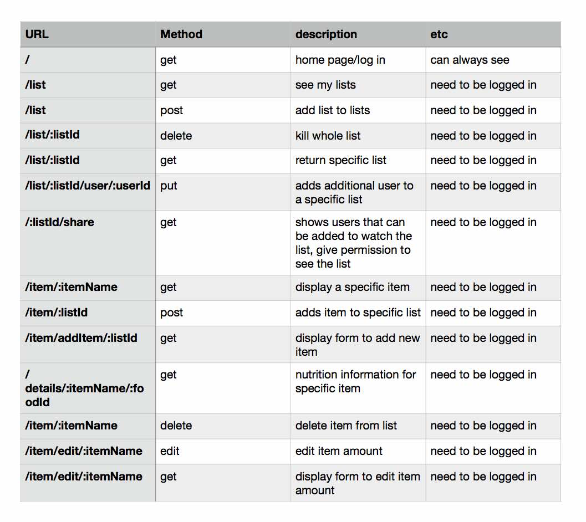

# TrickOrTrader-the coolest app for candy exchange
### Hackathon project

# Technologies used #

* HTML/EJS
* CSS
* vanilla JavaScript
* DOM
* JSON
* AJAX
* APINutrition API- provided by Edamam
* jQuery
* Bootstrap
* Node.js
* npm
* RESTful
* Sequelize
* Auth

# Installation instructions #
* Run `npm install` to install dependencies
* Use `nodemon` to start your application

* View this project on <a href="https://shrouded-meadow-47004.herokuapp.com/">Heroku</a>

# Approach taken: #

_Planning:_
## User Stories ##

* As a user, I want to be able to share the available candy with my friends, only with my friends.
* As a user, I want to be able to delete specific candy.
* As a user, I want to add comment for what I am looking to trade my candy and how much do I have.
* As a user, I want to edit amount and comment for specific candy.

_Pseudo coding:_
_planing the flow of the app:_
1. We came together with the designer team, decided what is real to implement in a few hours hackathon.
2. We planned the app carefully making first the user stories and then planned each page individually
3. To spare the time we have splitted the work and started implemented one page design while designer team was working on the next page design.

_planing the routes:_

_Execution:_ 

1.     We have started with the items addition to one list, delete from list and editing amount.

2.     I have connected the nutrition API based on item name to my item.

3.     I have created the lists and connected the items to list.

4.     List can have many users and users can have many lists.

5.     Added function for possibility to share specific list with another signup user.

6.     Edited my ejs and CSS for better presentation on the screen using bootstrap.
